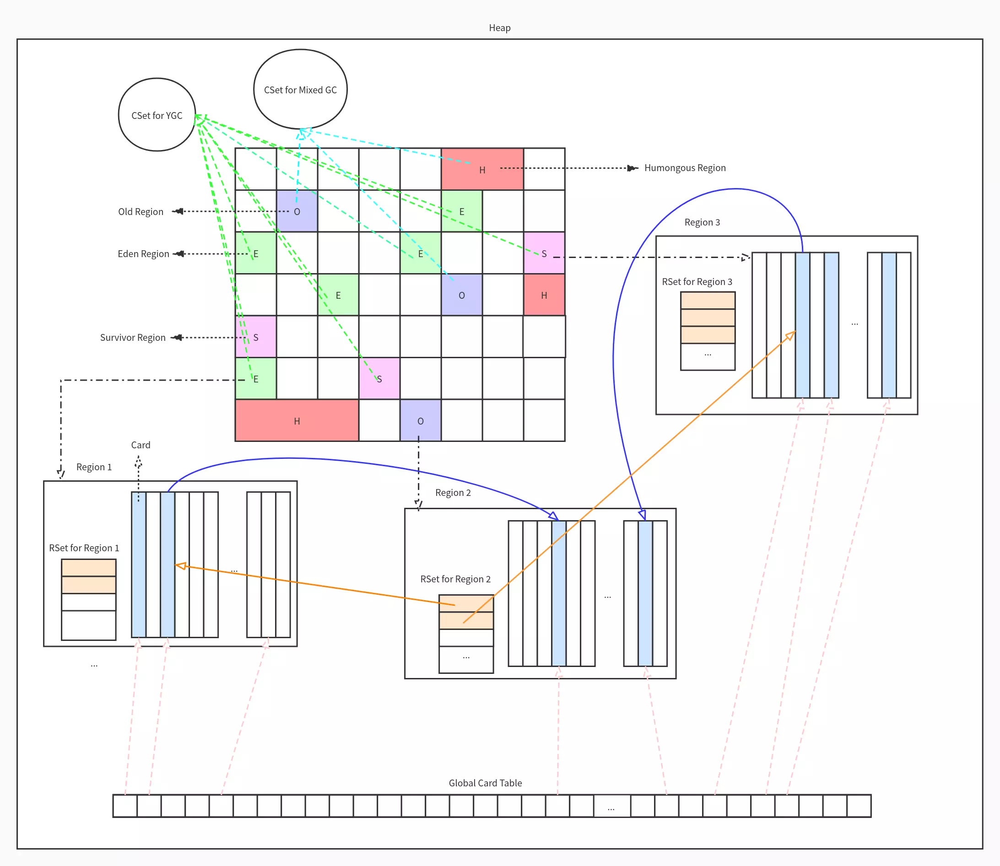
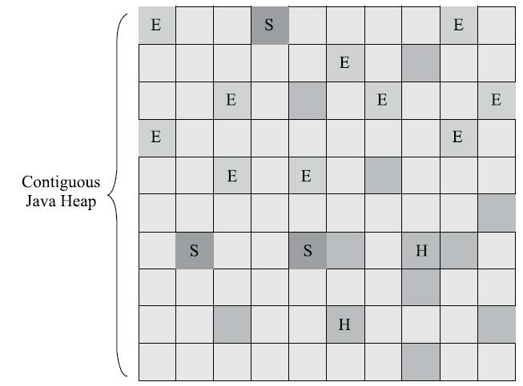
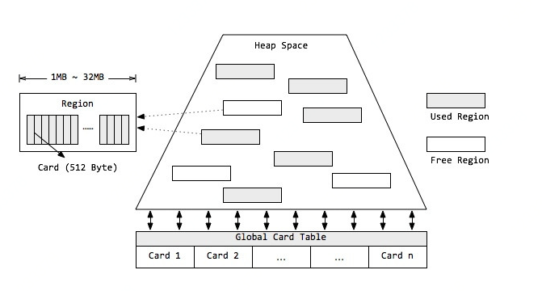
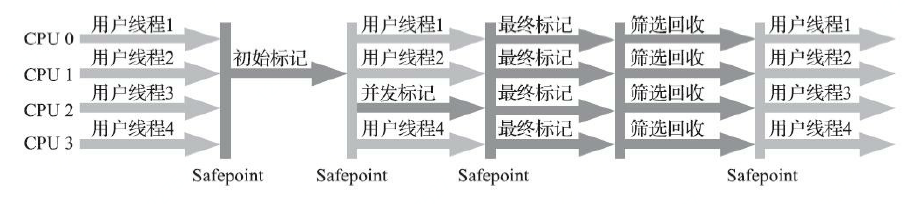

== 第四部分 G1（Garbage First）收集器

G1收集器是垃圾收集器技术发展历史上的里程碑式的成果，它开创了收集器 `面向局部收集的设计思路和基于Region的内存布局形式` 。

 开启选项：-XX:+UseG1GC

=== 分区
G1采用了分区(Region)的思路，不再坚持固定大小以及固定数量的分代区域划分，而是把连续的Java堆划分为多个大小相等的独立区域（Region），每一个Region都可以根据需要，扮演新生代的Eden空间、Survivor空间，或者老年代空间，收集器能够对扮演不同角色的Region采用不同的策略去处理。启动时可以通过参数-XX:G1HeapRegionSize=n可指定分区大小(1MB~32MB，且必须是2的幂)，默认将整堆划分为2048个分区。

Region中还有一类特殊的Humongous区域，专门用来存储大对象。G1认为只要大小超过了一个
Region容量一半的对象即可判定为大对象。而对于那些超过了整个Region容量的超级大对象，
将会被存放在N个连续的Humongous Region之中，有时候不得不先启动FullGC，
G1的大多数行为都把Humongous Region作为老年代，

H区有以下几个特点：

** 每个H Object会放在1个或者多个连续的Region里。

** 直接分配到了老年代，防止反复拷贝移动

** 在YGC、并发标记阶段、cleanup和FGC阶段回收

** 在分配H Object之前先检查是否超过了 initiating heap occupancy percent （由参数-XX:InitiatingHeapOccupancyPercent控制）
和the marking threshold 如果超过的话就启动并发收集周期，为的是提早回收，防止Evacuation Failure 和 Full GC。

==== 为什么要有H区？
G1做了一个优化：通过查看所有根对象以及年轻代分区的RSet，如果确定RSet中巨型对象没有任何引用，则说明G1发现了一个不可达的巨型对象，该对象分区会被回收。

=== 堆空间

* G1 同样可以通过 -Xms/-Xmx 来指定堆空间大小
* 当发生YGC 和 Mixed GC时，通过计算GC与应用的耗费时间比，自动调整堆空间大小。
* 如果GC频率太高可以增加堆空间大小降低GC频率
**  目标参数-XX:GCTimeRatio即为GC与应用的耗费时间比：G1默认为12（JDK7,8为99，JDK11+开始为12）
**  通过-XX:GCTimeRatio=<value>我们告诉JVM吞吐量要达到的目标值。 更准确地说，-XX:GCTimeRatio=N指定目标应用程序线程的执行时间(与总的程序执行时间)达到N/(N+1)的目标比值。 例如，通过-XX:GCTimeRatio=9我们要求应用程序线程在整个执行时间中至少9/10是活动的(因此，GC线程占用其余1/10)。 基于运行时的测量，JVM将会尝试修改堆和GC设置以期达到目标吞吐量。 -XX:GCTimeRatio的默认值是99，也就是说，应用程序线程应该运行至少99%的总执行时间。

=== 分代

* 而无需整堆扫描，避免长命对象的拷贝，同时独立收集有助于降低响应时间。
* G1将内存在逻辑上划分为年轻代和老年代
* 但年轻代空间并不是固定不变的，当现有年轻代分区占满时，JVM会分配新的空闲分区加入到年轻代空间。
* 整个年轻代内存会在初始空间-XX:NewSize与最大空间-XX:MaxNewSize之间动态变化，且由参数目标暂停时间-XX:MaxGCPauseMillis、需要扩缩容的大小以及分区的已记忆集合(RSet)计算得到
** 当然，G1依然可以设置固定的年轻代大小(参数-XX:NewRatio、-Xmn)，但同时暂停目标将失去意义

=== 本地分配缓冲区
* LAB(Local allocation buffer): 每个线程均可以“认领”某个分区用于线程本地的内存分配，不需要顾及分区是否连续。
* TLAB(Thread Local allocation buffer) 应用线程可以独占的本地缓冲区
* GCLAB(GC Local allocation buffer) 每次垃圾收集时，每个GC线程同样也可以占用一个本地缓存区用来转移对象，每次转移对象都会将对象复制到s区
* PLAB(Promotion Local allocation buffer) 对于从Eden/Survivor空间晋升到s/o 空间的对象，同样有GC独占的本地缓冲区进行操作。

=== 卡片
在每个分区内部又被分成了若干个大小为512 Byte卡片，标识堆内存最小可用粒度。所有分区的卡片将会记录在全局卡片表(Global Card Table)中，分配的对象会占用物理上连续的若干个卡片，当查找对分区内对象的引用时便可通过记录卡片来查找该引用对象(见RSet)。每次对内存的回收，都是对指定分区的卡片进行处理。

==== 特点

 *  *用户可指定期望的停顿时间*

 G1收集器之所以能建立起可预测的停顿时间模型是因为它将Region作为单次回收的最小单元，既每次收集到的内存空间都是Region大小的整数倍，这样可以有计划地避免在整个Java堆中进行全区域的垃圾收集，更具体的处理思路是让G1收集器去跟踪各个Region里面的垃
圾堆积的“价值”大小，价值即回收所获得的空间大小以及回收所需时间的经验值，然后在后台维护一
个优先级列表，每次根据用户设定允许的收集停顿时间（使用参数-XX：MaxGCPauseMillis指定，默
认值是200毫秒），优先处理回收价值收益最大的那些Region，这也就是“Garbage First”名字的由来

 * *追求能够应付应用的内存分配速率，而不追求一次把整个Java堆全部清理干净*

  在G1收集器出现之前的所有 其他收集器，包括CMS在内，垃圾收集的目标范围要么是整个新生代（Minor GC），要么就是整个老 年代（Major GC），再要么就是整个Java堆（Full GC）。 而G1跳出了这个樊笼，它可以面向堆内存任
何部分来组成回收集进行回收，衡量标准不再是它属于哪个分代，而是哪块内存中存放的垃圾数量最多，回收收益最大，这就是G1收集器的Mixed GC模式

* 并行性：G1在回收期间，可以由多个GC线程同时工作，有效利用多核计算能力
* 并发性：G1拥有与应用程序交替执行的能力，部分工作可以和应用程序同时执行，一般来说，不会在整个回收期间完全阻塞应用程序。

==== 设计思路

* *将Java堆分成多个独立Region后，Region里面存在的跨Region引用对象如何解决？*
 ** 解决的思路：使用记忆集避免全堆作为GC Roots扫描，但在G1收集器上的记忆集的应用其实要复杂很多，它的每个Region都维护有自己的记忆集，这些记忆集会记录下别的Region指向自己的指针，并标记这些指针分别在哪些卡页的范围之内。里面存储的元素是卡表的索引号。这
种“双向”的卡表结构（卡表是“我指向谁”，这种结构还记录了“谁指向我”）比原来的卡表实现起来更
复杂，同时由于Region数量比传统收集器的分代数量明显要多得多，因此G1收集器要比其他的传统垃
圾收集器有着更高的内存占用负担。根据经验，`G1至少要耗费大约相当于Java堆容量10%至20%的额
外内存来维持收集器工作`。

* *在并发标记阶段如何保证收集线程与用户线程互不干扰地运行？*
 **  这里首先是要解决的是用户线程改变对象引用关系时，必须保证其不能打破原本的对象图结构，导致标记结果出现错误，该问题的解决办法是G1收集器通过使用原始快照(SATB)算法来实现的。此外垃圾收集对用户线程的影响还体现在回收过程中新创建对象的内存分配上，程序要继续运行就肯定会持续有新对象被创建，G1为每一个Region设计了两个名为TAMS（Top at Mark Start）的指针，把Region中的一部分空间
划分出来用于并发回收过程中新对象的分配，并发回收时新分配的对象地址都必须要在这两个指针位置以上。G1收集器默认在这个地址以上的对象是被隐式标记过的，既默认它们是存活的，不纳入回收范围。与CMS中
的“Concurrent Mode Failure”失败会导致Full GC类似，如果内存回收的速度赶不上内存分配的速度，
G1收集器也要被迫冻结用户线程执行，导致Full GC而产生长时间“Stop The World”。

* *怎样建立起可靠的停顿预测模型？*
 **  用户通过-XX：MaxGCPauseMillis参数指定的停顿时间只意味着垃圾收集发生之前的期望值，但G1收集器要怎么做才能满足用户的期望呢？G1收集器的停顿预测模型是以衰减均值为理论基础来实现的，在垃圾收集过程中，G1收集器会记录每个Region的回收耗时，每个Region记忆集里的脏卡数量等各个可测量的步骤花费的成本，
并分析得出平均值、标准偏差、置信度等统计信息。平均值代表整体平均状态，但衰减平均值更准确地代表“最近的”平均状态。换句话说，Region的统计状态越新越能决定其回收的价值。然后通过这些信息预测现在开始回收的话，由哪些Region组成回收集才可以在不超过期望停顿时间的约束下获得最高的收益。

==== 数据结构

=== Rset （Remember Set，已记忆集合)
RSet记录了其他Region中的对象引用本Region中对象的关系. RSet的价值在于使得垃圾收集器不需要扫描整个堆找到谁引用了当前分区中的对象，只需要扫描RSet即可. 堆内存中的每个region都有一个RSet. RSet 使heap区能并行独立地进行垃圾集合. RSets的总体影响小于5%.

* G1为了避免STW式的整堆扫描，在每个分区记录了一个记忆集合（Rset）,内部类似于一个反向指针，记录引用分区内对象的卡片card索引
* 当要回收该分区region时，通过扫描分区的Rset，来确定引用本分区内的对象是否存活，进而确定本分区内的对象存活情况
* 只有老年代分区会记录Rset记录。

=== PRT(Per Region Table)
RSet在内部使用Per Region Table(PRT)记录分区Region的引用情况。
由于RSet的记录要占用分区Region的空间，如果一个分区非常"受欢迎"，那么RSet占用的空间会上升，从而降低分区Region的可用空间。
G1应对这个问题采用了改变RSet的密度的方式，在PRT中将会以三种模式记录引用：

* 稀少：直接记录引用对象的卡片Card的索引
* 细粒度：记录引用对象的分区Region的索引
* 粗粒度：只记录引用情况，每个分区对应一个比特位

由上可知，粗粒度的PRT只是记录了引用数量，需要通过整堆Heap扫描才能找出所有引用，因此扫描速度也是最慢的。

=== Collection Sets* 简称 CSets.
收集集合,一组可被回收的分区的集合。在CSet中存活的数据会在GC过程中被移动到另一个可用分区，CSet中的分区可以来自Eden空间、survivor空间、或者老年代。CSet会占用不到整个堆空间的1%大小

* 收集集合(CSet)代表每次GC暂停时回收的一系列目标分区Region
* 年轻代手机（YGC）的CSet只容纳年轻代分区，而混合收集（Mixed GC）会通过启发式算法，在老年代候选回收分区中，筛选出回收收益最高的分区添加到CSet中
** 候选老年代分区的CSet准入条件，可以通过活跃度阈值-XX:G1MixedGCLiveThresholdPercent(默认85%)进行设置，从而拦截那些回收开销巨大的对象；
** 同时，每次混合收集可以包含候选老年代分区，可根据CSet对堆的总大小占比-XX:G1OldCSetRegionThresholdPercent(默认10%)设置数量上限。

=== 年轻代收集集合 CSet of Young Collection

* 应用线程不断活动后，年轻代空间会被逐渐填满。当JVM分配对象到Eden区域失败(Eden区已满)时，便会触发一次STW式的年轻代收集。
* 在年轻代收集中，Eden分区存活的对象将被拷贝到Survivor分区；
原有Survivor分区存活的对象，将根据任期阈值(tenuring threshold)分别晋升到PLAB中，新的survivor分区和老年代分区。而原有的年轻代分区将被整体回收掉。
* 年轻代收集还负责维护对象的年龄(存活次数)，辅助判断老化(tenuring)对象晋升的时候是到Survivor分区还是到老年代分区。

=== 混合收集集合 CSet of Mixed Collection
* 当老年代占用空间超过整堆比IHOP阈值-XX:InitiatingHeapOccupancyPercent(老年代占整堆比，默认45%)时，G1就会启动一次混合垃圾收集周期。
* 首先经理并发标记周期，识别出高收益的老年代分区。

*如果我们不去计算用户线程运行过程中的动作（如使用写屏障维护记忆集的操作），G1收集器的
运作过程大致可划分为以下四个步骤：*

 * 初始标记（Initial Marking）：仅仅只是标记一下GC Roots能直接关联到的对象，并且修改TAMS
指针的值，让下一阶段用户线程并发运行时，能正确地在可用的Region中分配新对象。这个阶段需要
停顿线程，但耗时很短，而且是借用进行Minor GC的时候同步完成的，所以G1收集器在这个阶段实际
并没有额外的停顿。
* 并发标记（Concurrent Marking）：从GC Root开始对堆中对象进行可达性分析，递归扫描整个堆
里的对象图，找出要回收的对象，这阶段耗时较长，但可与用户程序并发执行。当对象图扫描完成以
后，还要重新处理SATB记录下的在并发时有引用变动的对象。
* 最终标记（Final Marking）：对用户线程做另一个短暂的暂停，用于处理并发阶段结束后仍遗留
下来的最后那少量的SATB记录。
* 筛选回收（Live Data Counting and Evacuation）：负责更新Region的统计数据，对各个Region的回
收价值和成本进行排序，根据用户所期望的停顿时间来制定回收计划，可以自由选择任意多个Region
构成回收集，然后把决定回收的那一部分Region的存活对象复制到空的Region中，再清理掉整个旧
Region的全部空间。这里的操作涉及存活对象的移动，是必须暂停用户线程，由多条收集器线程并行
完成的。

=== GC日志

并发标记周期 Concurrent Marking Cycle
----
[GC concurrent-root-region-scan-start]
[GC concurrent-root-region-scan-end, 0.0094252 secs]
# 根分区扫描，可能会被 YGC 打断，那么结束就是如：[GC pause (G1 Evacuation Pause) (young)[GC concurrent-root-region-scan-end, 0.0007157 secs]
[GC concurrent-mark-start]
[GC concurrent-mark-end, 0.0203881 secs]
# 并发标记阶段
[GC remark [Finalize Marking, 0.0007822 secs] [GC ref-proc, 0.0005279 secs] [Unloading, 0.0013783 secs], 0.0036513 secs]
#  重新标记，STW
 [Times: user=0.01 sys=0.00, real=0.00 secs]
[GC cleanup 13985K->13985K(20480K), 0.0034675 secs]
 [Times: user=0.00 sys=0.00, real=0.00 secs]
# 清除
----

年轻代收集 YGC
----
[GC pause (G1 Evacuation Pause) (young), 0.0022483 secs]
# young -> 年轻代      Evacuation-> 复制存活对象
   [Parallel Time: 1.0 ms, GC Workers: 10] # 并发执行的GC线程数，以下阶段是并发执行的
      [GC Worker Start (ms): Min: 109.0, Avg: 109.1, Max: 109.1, Diff: 0.2]
      [Ext Root Scanning (ms): Min: 0.1, Avg: 0.2, Max: 0.3, Diff: 0.2, Sum: 2.3] # 外部根分区扫描
      [Update RS (ms): Min: 0.0, Avg: 0.0, Max: 0.0, Diff: 0.0, Sum: 0.0] # 更新已记忆集合 Update RSet，检测从年轻代指向老年代的对象
         [Processed Buffers: Min: 0, Avg: 0.0, Max: 0, Diff: 0, Sum: 0]
      [Scan RS (ms): Min: 0.0, Avg: 0.0, Max: 0.0, Diff: 0.0, Sum: 0.0]# RSet扫描
      [Code Root Scanning (ms): Min: 0.0, Avg: 0.0, Max: 0.0, Diff: 0.0, Sum: 0.1] # 代码根扫描
      [Object Copy (ms): Min: 0.3, Avg: 0.3, Max: 0.4, Diff: 0.1, Sum: 3.5] # 转移和回收，拷贝存活的对象到survivor/old区域
      [Termination (ms): Min: 0.0, Avg: 0.0, Max: 0.0, Diff: 0.0, Sum: 0.0] # 完成上述任务后，如果任务队列已空，则工作线程会发起终止要求。
         [Termination Attempts: Min: 1, Avg: 5.8, Max: 9, Diff: 8, Sum: 58]
      [GC Worker Other (ms): Min: 0.0, Avg: 0.0, Max: 0.0, Diff: 0.0, Sum: 0.1] # GC外部的并行活动，该部分并非GC的活动，而是JVM的活动导致占用了GC暂停时间(例如JNI编译)。
      [GC Worker Total (ms): Min: 0.5, Avg: 0.6, Max: 0.7, Diff: 0.2, Sum: 5.9]
      [GC Worker End (ms): Min: 109.7, Avg: 109.7, Max: 109.7, Diff: 0.0]
   [Code Root Fixup: 0.0 ms] # 串行任务，根据转移对象更新代码根
   [Code Root Purge: 0.0 ms] #串行任务， 代码根清理
   [Clear CT: 0.5 ms] #串行任务，清除全局卡片 Card Table 标记
   [Other: 0.8 ms]
      [Choose CSet: 0.0 ms] # 选择下次收集集合  CSet
      [Ref Proc: 0.4 ms] # 引用处理 Ref Proc，处理软引用、弱引用、虚引用、final引用、JNI引用
      [Ref Enq: 0.0 ms] # 引用排队 Ref Enq
      [Redirty Cards: 0.3 ms] # 卡片重新脏化 Redirty Cards：重新脏化卡片
      [Humongous Register: 0.0 ms]
      [Humongous Reclaim: 0.0 ms] # 回收空闲巨型分区 Humongous Reclaim，通过查看所有根对象以及年轻代分区的RSet，如果确定RSet中巨型对象没有任何引用，该对象分区会被回收。
      [Free CSet: 0.0 ms]  # 释放分区 Free CSet
   [Eden: 12288.0K(12288.0K)->0.0B(11264.0K) Survivors: 0.0B->1024.0K Heap: 12288.0K(20480.0K)->832.0K(20480.0K)]
 [Times: user=0.01 sys=0.00, real=0.00 secs]
----

----
# 从年轻代分区拷贝存活对象时，无法找到可用的空闲分区
# 从老年代分区转移存活对象时，无法找到可用的空闲分区 这两种情况之一导致的 YGC
[GC pause (G1 Evacuation Pause) (young) (to-space exhausted), 0.0916534 secs]
----

----
# 并发标记周期 Concurrent Marking Cycle 中的 根分区扫描阶段，被 YGC中断
[GC pause (G1 Evacuation Pause) (young)[GC concurrent-root-region-scan-end, 0.0007157 secs]
----

混合收集周期 Mixed Collection Cycle, Mixed GC
----
# 并发标记周期 Concurrent Marking Cycle 的开始
[GC pause (G1 Evacuation Pause) (young) (initial-mark) , 0.0443460 secs]
----
Full GC
----
[Full GC (Allocation Failure) 20480K->9656K(20480K), 0.0189481 secs]
   [Eden: 0.0B(1024.0K)->0.0B(5120.0K) Survivors: 0.0B->0.0B Heap: 20480.0K(20480.0K)->9656.8K(20480.0K)], [Metaspace: 4960K->4954K(1056768K)]
 [Times: user=0.03 sys=0.00, real=0.02 secs]
----

*G1与CMS对比优势与劣势*

 * 可以指定最大停顿时间
 * 分Region的内存布局
 * 按收益动态确定回收集
 * 不会产生内存空间碎片：单从最传统的算法理论上看，G1也更有发展潜力。与CMS
的“标记-清除”算法不同，G1从整体来看是基于“标记-整理”算法实现的收集器，但从局部（两个Region
之间）上看又是基于“标记-复制”算法实现，无论如何，这两种算法都意味着G1运作期间不会产生内存
空间碎片

 * 在用户程序运行过程中，G1无论是为了垃圾收集产生的内存占用（Footprint）还是程序运行时的额外执行负载都要比CMS要高
 * G1的卡表实现更为复杂，占用堆空间更多。堆中每个Region，无论扮演的是新生代还是老年代角色，都必须有一份卡表，这导致G1的记忆集（和
其他内存消耗）可能会占整个堆容量的20%乃至更多的内存空间；相比起来CMS的卡表就相当简单，
只有唯一一份，而且只需要处理老年代到新生代的引用，反过来则不需要，由于新生代的对象具有朝
生夕灭的不稳定性，引用变化频繁，能省下这个区域的维护开销是很划算的

