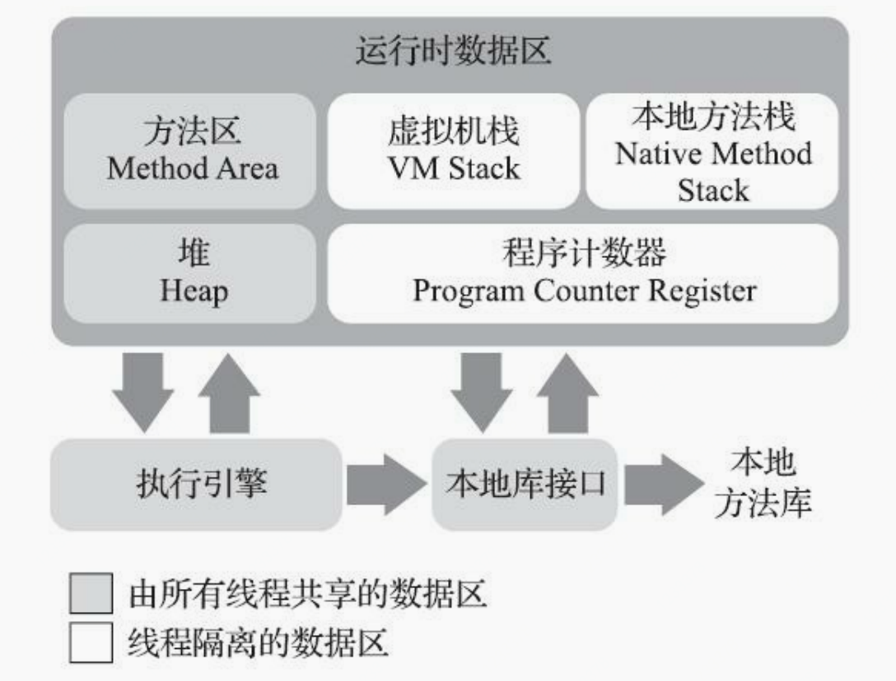
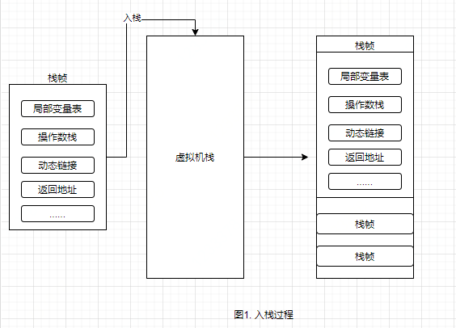
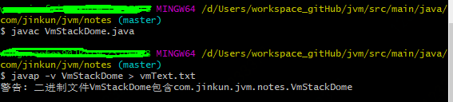
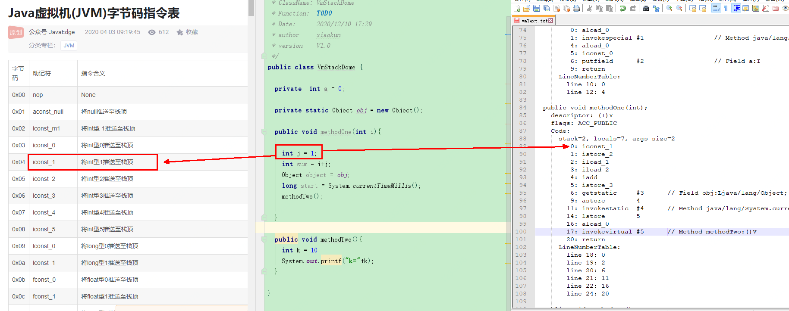
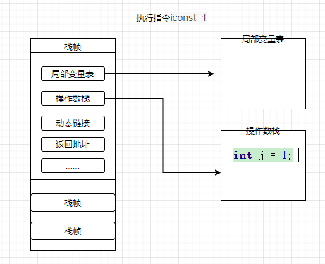
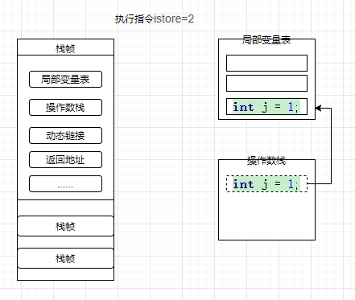
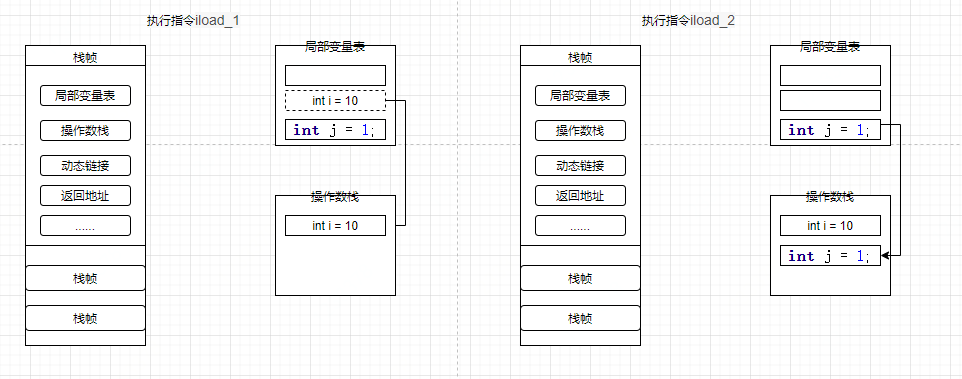
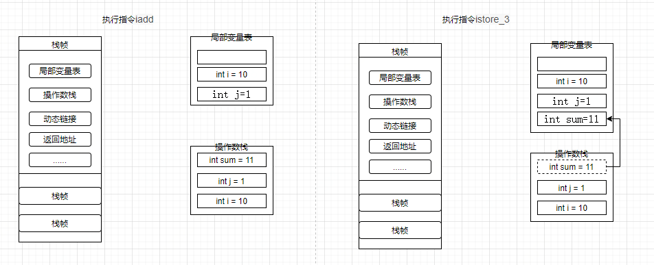

= 第二部分 自动内存管理实践

== 程序计数器（Program Counter Register）

程序计数器主要存储当前线程所执行的字节码行号指示器，通过改变计数器的值来获取下一条需要执行的字节码指令。

 首先我们要搞清楚JVM的多线程实现方式。JVM的多线程是通过CPU时间片轮转（即线程轮流切换并分配处理器执行时间）算法来实现的。也就是说，某个线程在执行过程中可能会因为时间片耗尽而被挂起，而另一个线程获取到时间片开始执行。当被挂起的线程重新获取到时间片的时候，它要想从被挂起的地方继续执行，就必须知道它上次执行到哪个位置，在JVM中，通过程序计数器来记录某个线程的字节码执行位置。因此，程序计数器是具备线程隔离的特性，也就是说，每个线程工作时都有属于自己的独立计数器。

特点：

* 线程隔离性,每个线程有自己的独立技术器。
* 执行java方法时，计数器中记录的是正在执行的虚拟机字节码指令地址
* 执行native方法时，计数器值为空。why? native方法大多是通过C实现的并未编译成需要执行的字节码指令，也就不需要存储执行指令地址了。
* jvm规范中唯一没有规定OutOfMemoryError情况的区域
* 占用内存很小，可忽略不计

== 虚拟机栈（VM Stack）

虚拟机栈描述的是Java方法执行的线程内存模型，存放的是一个方法的所有局部变量。

  每个方法被执行的时候，虚拟机栈都会同步创建一个栈帧（Stack Frame） 用于存储局部变量表、操作数栈、动态链接、方法出口等信息。每一个方法被调用直至执行完毕的过程就对应着一个栈帧在虚拟机中从入栈到出栈的过程

下面我们用这段代码介绍下虚拟机栈结构及用途

.VmStackDome.java
[{java_src_attr}]
----
public class VmStackDome {

    private static Object obj = new Object();

    public void methodOne(int i){

      int j = 1;
      int sum = i+j;
      Object object = obj;
      long start = System.currentTimeMillis();
      methodTwo();

    }

    public void methodTwo(){
      int k = 10;
      System.out.printf("k="+k);
    }

}
----

.. 当虚拟机要执行一个方法methodOne()时，就会有一个栈帧压入线程独享的虚拟机栈中，如下图

.. 当线程开始执行这个方法时这些局部变量应该从哪里读取，又是在哪里做的运算？我们通过看这个类的反编译代码来看

.. 我们直接看这个方法的执行区，可以看到在执行int j=1;时对应的执行指令是iconst_1,我们再参考Java虚拟机字节码指令表看，iconst_1的含义是将int型1推送至栈顶

.. 第二步执行istore_2指令,指令含义：将栈顶int型数值存入第三个本地变量

.. 执行iload_1指令（将第二个int型本地变量推送至栈顶）、iload_2（将第三个int型本地变量推送至栈顶）假设 i=10;

.. 执行iadd指令(将栈顶两int型数值相加并将结果压入栈顶)、执行istore_3（将栈顶int型数值存入第四个本地变量）

