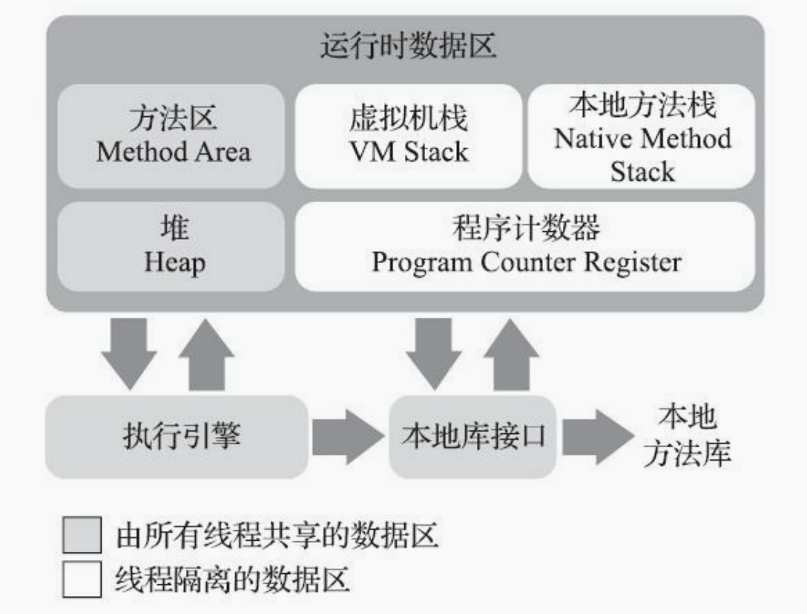

= 第二部分 自动内存管理实践

== 程序计数器（Program Counter Register）

程序计数器主要存储当前线程所执行的字节码行号指示器，通过改变计数器的值来获取下一条需要执行的字节码指令。

 首先我们要搞清楚JVM的多线程实现方式。JVM的多线程是通过CPU时间片轮转（即线程轮流切换并分配处理器执行时间）算法来实现的。也就是说，某个线程在执行过程中可能会因为时间片耗尽而被挂起，而另一个线程获取到时间片开始执行。当被挂起的线程重新获取到时间片的时候，它要想从被挂起的地方继续执行，就必须知道它上次执行到哪个位置，在JVM中，通过程序计数器来记录某个线程的字节码执行位置。因此，程序计数器是具备线程隔离的特性，也就是说，每个线程工作时都有属于自己的独立计数器。

特点：

* 线程隔离性,每个线程有自己的独立技术器。
* 执行java方法时，计数器中记录的是正在执行的虚拟机字节码指令地址
* 执行native方法时，计数器值为空。why? native方法大多是通过C实现的并未编译成需要执行的字节码指令，也就不需要存储执行指令地址了。
* jvm规范中唯一没有规定OutOfMemoryError情况的区域
* 占用内存很小，可忽略不计

== 虚拟机栈（VM Stack）

虚拟机栈描述的是Java方法执行的线程内存模型，存放的是一个方法的所有局部变量。

  每个方法被执行的时候，虚拟机栈都会同步创建一个栈帧（Stack Frame） 用于存储局部变量表、操作数栈、动态链接、方法出口等信息。每一个方法被调用直至执行完毕的过程就对应着一个栈帧在虚拟机中从入栈到出栈的过程

下面我们用这段代码介绍下虚拟机栈结构及用途

.VmStackDome.java
[{java_src_attr}]
----
public class VmStackDome {

    private static Object obj = new Object();

    public void methodOne(int i){

      int j = 1;
      int sum = i+j;
      Object object = obj;
      long start = System.currentTimeMillis();
      methodTwo();

    }

    public void methodTwo(){
      int k = 10;
      System.out.printf("k="+k);
    }

}
----

. 当虚拟机要执行一个方法methodOne()时，就会有一个栈帧压入线程独享的虚拟机栈中，如下图

image::images/ruzhanguocheng.png[]

. 当线程开始执行这个方法时这些局部变量应该从哪里读取，又是在哪里做的运算？我们通过看这个类的反编译代码来看

image::images/bianyi.png[]

.. 我们直接看这个方法的执行区，可以看到在执行int j=1;时对应的执行指令是iconst_1,我们再参考Java虚拟机字节码指令表看，iconst_1的含义是将int型1推送至栈顶

image::images/iconst_1.png[]

image::images/iconst_1-2.png[]

.. 执行istore_2指令,指令含义：将栈顶int型数值存入第三个本地变量

image::images/istore.png[]

.. 执行iload_1指令（将第二个int型本地变量推送至栈顶）、iload_2（将第三个int型本地变量推送至栈顶）假设 i=10;

image::images/iload.png[]

.. 执行iadd指令(将栈顶两int型数值相加并将结果压入栈顶)、执行istore_3（将栈顶int型数值存入第四个本地变量）

image::images/iadd.png[]

.. 接下来执行istore_3指令（将栈顶int型数值存入第四个本地变量）

.. 接下来执行getstatic指令（获取指定类的静态域, 并将其压入栈顶）

.. 思考一个问题，执行字节码指令是哪个组件在执行？

... 答案是：执行引擎，它负责执行虚拟机的字节码，现代虚拟机为了提高执行效率，会使用即时编译(just in time)技术将方法编译成机器码后再执行。

... Java HotSpot Client VM(-client)，为在客户端环境中减少启动时间而优化的执行引擎；本地应用开发使用。（如：eclipse）

... Java HotSpot Server VM(-server)，为在服务器环境中最大化程序执行速度而设计的执行引擎。应用在服务端程序。（如：tomcat）

... Java HotSpot Client模式和Server模式的区别

.... 当虚拟机运行在-client模式的时候,使用的是一个代号为C1的轻量级编译器, 而-server模式启动的虚拟机采用相对重量级,代号为C2的编译器. C2比C1编译器编译的相对彻底,服务起来之后,性能更高。JDK安装目录/jre/lib/（x86、i386、amd32、amd64）/jvm.cfg文件中的内容，-server和-client哪一个配置在上，执行引擎就是哪一个。如果是JDK1.5版本且是64位系统应用时，-client无效。在部分JDK1.6版本和后续的JDK版本(64位系统)中，-client参数已经不起作用了，Server模式成为唯一。

== 本地方法栈（Native Method Stacks）

与虚拟机所发挥的作用是非常相似的，其区别是虚拟机为本地Java方法执行字节码服务，本地方法栈为native方法执行字节码服务

image::images/nativeMethod.png[]

该线程首先调用了两个Java方法，而第二个Java方法又调用了一个本地方法，这样导致虚拟机使用了一个本地方法栈。假设这是一个C语言栈，其间有两个C函数，第一个C函数被第二个Java方法当做本地方法调用，而这个C函数又调用了第二个C函数。之后第二个C函数又通过本地方法接口回调了一个Java方法（第三个Java方法），最终这个Java方法又调用了一个Java方法

== 堆（Heap）

此内存区域唯一目的就是存放对象实例，Java世界里几乎所有的对象的实例都在这里分配内存。

 Java虚拟机根据对象存活的周期不同，把堆内存划分为几块，一般分为新生代、老年代和永久代（对HotSpot虚拟机而言），这就是JVM的内存分代策略。
    堆内存是虚拟机管理的内存中最大的一块，也是垃圾回收最频繁的一块区域，我们程序所有的对象实例都存放在堆内存中。给堆内存分代是为了提高对象内存分配和垃圾回收的效率。试想一下，如果堆内存没有区域划分，所有的新创建的对象和生命周期很长的对象放在一起，随着程序的执行，堆内存需要频繁进行垃圾收集，而每次回收都要遍历所有的对象，遍历这些对象所花费的时间代价是巨大的，会严重影响我们的GC效率。
    有了内存分代，情况就不同了，新创建的对象会在新生代中分配内存，经过多次回收仍然存活下来的对象存放在老年代中，静态属性、类信息等存放在永久代中，新生代中的对象存活时间短，只需要在新生代区域中频繁进行GC，老年代中对象生命周期长，内存回收的频率相对较低，不需要频繁进行回收，永久代中回收效果太差，一般不进行垃圾回收，还可以根据不同年代的特点采用合适的垃圾收集算法。分代收集大大提升了收集效率，这些都是内存分代带来的好处。
    当前主流的Java堆都是可扩展的，通过-Xmx和-Xms设定的，如果堆中没有内存完成实例分配也无法再扩展时，jvm就会抛出OutOfMemoryError异常

特点

* 线程共享的一块区域
* 可以划分出多个线程私有的分配缓冲区（Thread Local Allocation Buffer，TLAB）已提升分配对象时的效率
* 堆可以处于物理上不连续的区域，但逻辑上是连续的。

image::images/neicunfendai.png[]

== 方法区（Method Area）

它用于存储已被虚拟机加载的类型信息(class)、常量、静态变量、即时编译后的代码缓存等数据。
jdk1.8之后元空间实现了方法区，使用内存区域是本地内存。

 方法区 ≠ 永久代/元空间。 方法区只是一种逻辑上的概念，是一中规范，而永久代/元空间是实现层面的东西，指物理上的一块空间。元空间并不在虚拟机中，而是使用本机内存，元空间大小仅受本地内存限制。

特点

* 线程共享的一块区域
* jdk8之后实现层是元空间，不属于虚拟机，直接占用本机内存。
* jdk7叫永久代，已经把原本放在永久代的字符串常量池、静态变量移出，
* jdk6永久代全部属于堆空间

== 运行时常量池（Runtime Constant Pool）

存储常量池表--编译期生成的各种字面量与符号引用。这部分内容将在类加载后存放到方法区的运行时常量池中。

image::images/yunxingshichangliangchi.png[]

