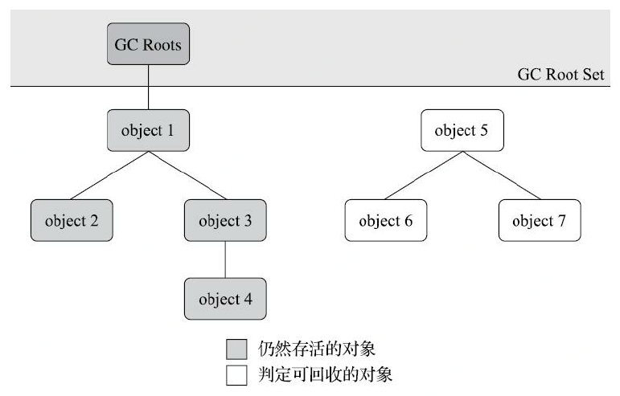
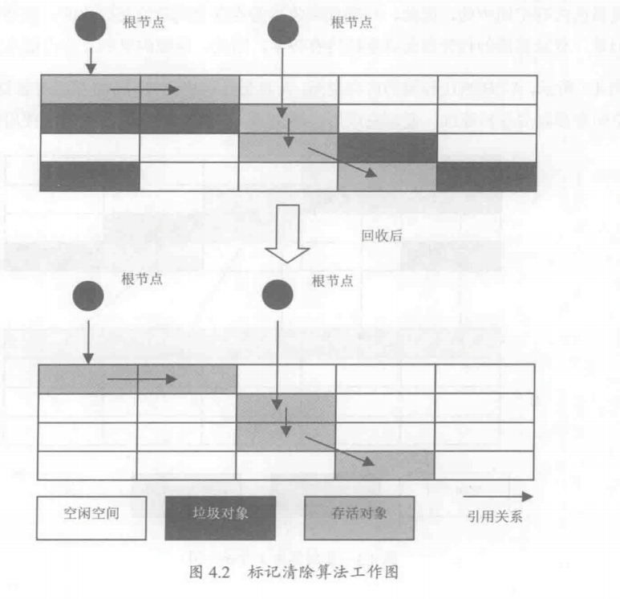
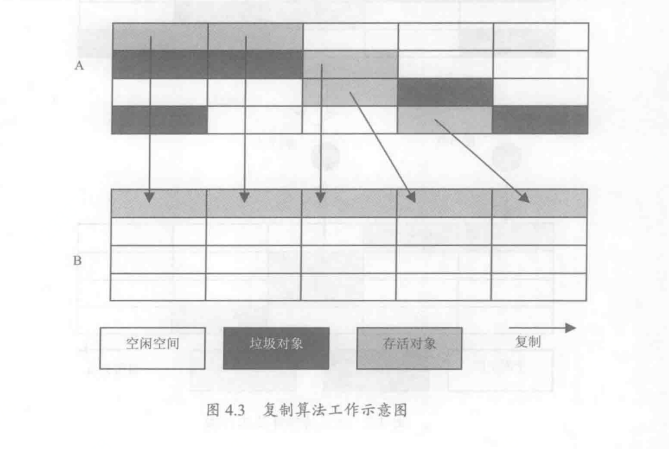
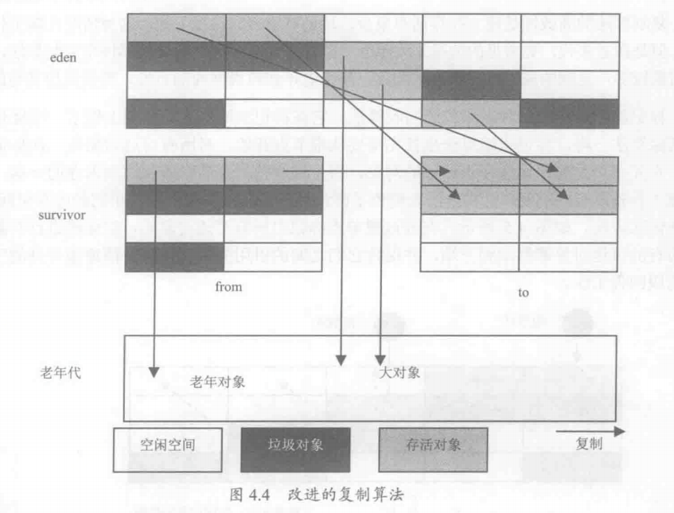
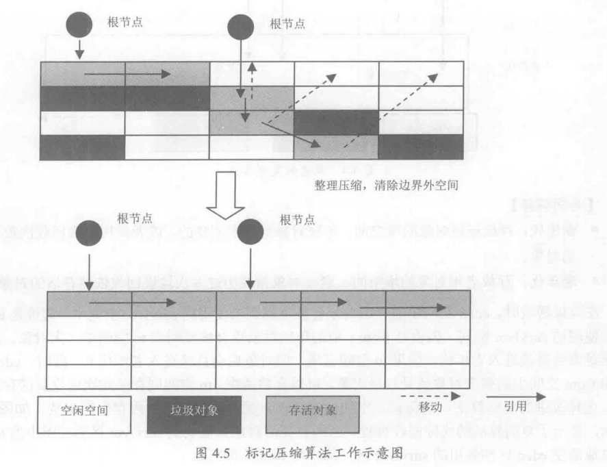
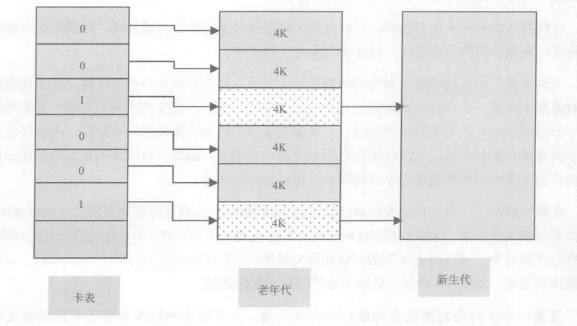
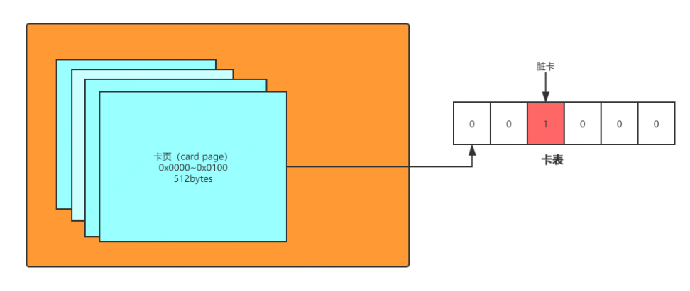

= 第三部分 如何确定对象是存活还是死亡

前面了解了Java内存运行时区域的各个部分，其中程序计数器、虚拟机栈、本地方法栈3个区域随线程而生，随线程而灭，栈
中的栈帧随着方法的进入和退出而有条不紊地执行着出栈和入栈操作。每一个栈帧中分配多少内存基
本上是在类结构确定下来时就已知的，因此这几个区域的内存分配和回收都具备确定性，
在这几个区域内就不需要过多考虑如何回收的问题，当方法结束或者线程结束时，内存自然就跟随着
回收了。

但是`堆` 和`方法区`则有着很显著的不确定性：一个接口的多个实现类需要的内存可能不一样，一个方法所执行的不同条件，
只有处于运行期我们才能知道程序究竟会创建哪些对象，这部分内存的分配和回收是动态的。

说起垃圾收集我们需要考虑三个问题::

. 哪些内存需要回收？
. 什么时候回收？
. 如何回收？

== 引用计算算法（Reference Counting）

对每个对象的引用进行计数，每当有一个地方引用它时计数器 +1、引用失效则 -1，引用的计数放到对象头中，大于 0 的对象被认为是存活对象。
在Java领域，至少主流的Java虚拟机里面都没有选用引用计数算法来管理内存，主要原因是，这个看似简单的算法有很多例外情况要考虑，必须要配合大量额外处理才能保证正确地工作，譬如单纯的引用计数就很难解决对象之间相互循环引用的问题。
循环引用的问题可通过 Recycler 算法解决，但是在多线程环境下，引用计数变更也要进行昂贵的同步操作，性能较低，早期的编程语言会采用此算法。

== 可达性分析（Reachability Analysis）

这个算法的基本思路就是通过
一系列称为“GC Roots”的根对象作为起始节点集，从这些节点开始，根据引用关系向下搜索，搜索过
程所走过的路径称为“引用链”（Reference Chain），如果某个对象到GC Roots间没有任何引用链相连，
或者用图论的话来说就是从GC Roots到这个对象不可达时，则证明此对象是不可能再被使用的

如图下图所示，对象object 5、object 6、object 7虽然互有关联，但是它们到GC Roots是不可达的，
因此它们将会被判定为可回收的对象。

在Java技术体系里面，固定可作为GC Roots的对象包括以下几种::
. 在虚拟机栈（栈帧中的本地变量表）中引用的对象，譬如各个线程被调用的方法堆栈中使用到的
参数、局部变量、临时变量等。
. 在方法区中类静态属性引用的对象，譬如Java类的引用类型静态变量。
. 在方法区中常量引用的对象，譬如字符串常量池（String Table）里的引用。
. 在本地方法栈中JNI（即通常所说的Native方法）引用的对象。
. Java虚拟机内部的引用，如基本数据类型对应的Class对象，一些常驻的异常对象（比如
NullPointExcepiton、OutOfMemoryError）等，还有系统类加载器。
. 所有被同步锁（synchronized关键字）持有的对象。
. 反映Java虚拟机内部情况的JMXBean、JVMTI中注册的回调、本地代码缓存等。

在可达性分析算法中判定为不可达的对象，也不是“非死不可”的，这时候它们暂时还处于“缓刑”阶段。要真正宣告一个对象死亡，至少要经历两次标记过程::

. 对象在进行可达性分析后发现没有与GC Roots相连接的引用链，那它将会被第一次标记,
. 判断是否需要筛选，筛选的条件是此对象是否有必要执行finalize()方法。假如对象没有覆盖finalize()方法，或者finalize()方法已经被虚拟机调用
过，那么虚拟机将这两种情况都视为“没有必要执行”。翻译成代码：

 ----
if(对象没有覆盖finalize()方法 || finalize()方法已经被虚拟机调用过){
     //没有必要执行finalize();
}else{
    //对象进入 F-Queue......
}
 ----

. 如果这个对象被判定为有必要执行finalize()方法，那么该对象将会被放置在一个名为F-Queue队列中，
然后虚拟机自动建立低调度优先级的Finalizer线程去执行他们的finalize()方法。（触发其开始运行，但并不承诺一定会等待它运行结束，如果某个对象的finalize()方法执行缓慢，或者更极端地发生了死循环，将很可能导
致F-Queue队列中的其他对象永久处于等待，甚至导致整个内存回收子系统的崩溃）

. 第二次标记：收集器将对F-Queue中的对象进行第二次小规模的标记。如果对
象要在finalize()中成功拯救自己——只要重新与引用链上的任何一个对象建立关联即可，譬如把自己
（this关键字）赋值给某个类变量或者对象的成员变量，那在第二次标记时它将被移出“即将回收”的集
合；如果对象这时候还没有逃脱，那基本上它就真的要被回收了。

[source,java]
----
include::{sourcedir}/FinalizeEscapeGC.java[]
----

----
运行结果：
finalize method executed!
yes, i am still alive :
no, i am dead :(
----

== 标记清除法（Mark-Sweep）

标记清除算法将垃圾回收分为两个阶段：标记阶段和清除阶段，算法分为“标记”和“清除”两个阶段：首先标记出所有需要回收的对象，在标记完成后，统一回收掉所有被标记的对象，也可以反过来，标记存活的对象，统一回收所有未被标记的对象

入下图：使用标记清除算法对一块连续的内存空间进行回收。从根节点开始（这里显示了2个根），所有的有引用关系的对象均被标记为存活对象（箭头表示引用）。从根节点起，不可达的对象均为垃圾对象。在标记操作完成后，系统回收所有不可达的空间。

* 该算法最大的缺点就是：回收后的空间是不连续的。在对象的空间分配过程中，尤其是大对象的内存分配，不连续的内存空间的工作效率要低于连续的空间。因此这也是该算法的最大缺点。优化升级版是：标记压缩法。

== 复制算法(Copying)

复制算法的核心思想是：将原来的内存空间分为两块，每次只使用其中一块，在进行垃圾回收时将正在使用的那块区域中存活对象复制到未使用的内存块中，之后清楚正在使用的内存块中的所有对象，交换两个内存的角色，完成垃圾回收。

如图所示：A、B两块相同的内存空间，A在进行垃圾回收时，将存活对象复制到B中，B中的空间在复制后保持连续。复制完成后清空A，并将B空间设置为当前使用空间。

在java的新生代串行垃圾回收器中使用了复制算法的思想，新生代分为eden空间、from空间和to空间3个部分。其中from和to空间可视为用于复制的两块大小相同、地位相等且可进行角色互换的空间快。如下图

== 标记压缩法（Mark-Compact）

标记清除算法在标记压缩算法的基础上做了一些优化，等同于标记清除算法执行完成后再进行一次内存碎片整理，因此也叫标记清理压缩算法（MarkSweepCompact）。

标记压缩算法也首先需要从根节点开始，对所有可达对象做一次标记。但之后它并不只是简单的清理未标记的对象，而是将所有的存活对象压缩到内存的一端。之后清理边界所有的空间。这种方法既避免了碎片的产生，又不需要两块相同的内存空间，因此性价比非常高。

如下图：通过跟节点标记出所有可达对象后，沿虚线进行对象移动，将所有的可达对象都移动到一端，并保持他们之间的引用关系，最后清理边界外的空间，即可完成回收工作。

== 分代收集理论--分代算法（Generational Collectiong）

分代算法的思想就是：内存区间根据对象的特点分为几块，根据每块内存区间的特点使用不同的回收算法，以提高垃圾回收的效率，一般会分成新生代和老年代两个区域。

. 新生代：Java虚拟机会将所有的新建对象都放入新生代的内存区域，新生代的特点是对象朝生夕灭，大约90%的对象都会被很快回收，因此新生代比较适合使用复制算法。

. 老年代：当一个对象经过几次回收后依然存活，对象就会被放入老年代的内存空间。在老年代中，几乎所有的对象都是经过几次垃圾回收后依然存活的。因此，可以认为这些对象在一段时期内、甚至在应用程序的整个生命周期中，都将是常驻内存的。如果依然使用复制算法回收老年代将需要复制大量对象，回收性价比远远低于新生代，因此老年代比较适合使用标记清除压缩算法。

但是这样会产生一个问题，年轻代中发生minor gc的频率很高，经常会扫描年轻代中的对象进行标记，如果老年代中有对象引用了年轻代中的对象，那岂不是每次进行minor gc时也要进行全堆的扫描？所以为了支持高频率的新生代回收，同时又避免把整个来年代加进GC Roots扫描范围，虚拟机会使用一种叫做卡表的数据结构来记录老年代引用新生代的关系。

** 记忆集--卡表

为解决对象跨代引用所带来的问题，垃圾收集器在新生代中建立了名为记忆集的数据结构。用于避免把整个老年代加进GC Roots扫描范围。

`记忆集` 是一种用于记录从非收集区域指向收集区域的指针集合的抽象数据结构。

`卡表` 卡表就是记忆集的一种具体实现（可以理解为hashMap与Map的关系），卡表是一个比特位集合，它定义了记忆集的记录精度、与堆内存的映射关系。每一个比特位可以用来表示老年代的某一区域中所有对象是否持有新生代对象的引用。这样在新生代GC时可以不用花大量时间扫描所有的老年代对象来确定每一个对象的引用关系，可以先扫码卡表
只有当卡表的标记位为1时，才需要扫码给定区域的老年代对象，而卡表为0的老年代对象，一定不含有新生代对象的引用。

以Hotspot虚拟机为例，卡表的设计，是将整个堆空间分割成一个个卡页（card page），每个卡页大小为512字节（其他虚拟机也基本都为2的n次幂），而卡表本事为一个简单的字节数组，记录当前对应卡页的标记值。当判断一个卡页中有存在对象的夸代引用时，将这个页标记为脏页，在进行 Minor GC 的时候，我们便可以不用扫描整个老年代，而是在卡表中寻找脏卡，并将脏卡中的对象加入到 Minor GC 的 GC Roots 里。当完成所有脏卡的扫描之后，Java 虚拟机便会将所有脏卡的标识位清零。

== 写屏障

  我们已经解决了如何使用记忆集来缩减GC Roots扫描范围的问题，但还没有解决卡表元素如何维护的问题，例如它们何时变脏、谁来把它们变脏等？
  卡表元素何时变脏的答案是很明确的——有其他分代区域中对象引用了本区域对象时，其对应的卡表元素就应该变脏，变脏时间点原则上应该发生在引用类型字段赋值的那一刻。但问题是如何变
脏，即如何在对象赋值的那一刻去更新维护卡表呢？

写屏障可以看作在虚拟机层面对“引用类型字段赋值”这个动作的AOP切面，在引用对象赋值时会产生一个环形通知，供程序执行额外的动作，也就是说赋值的
前后都在写屏障的覆盖范畴内。在赋值前的部分的写屏障叫作写前屏障，在赋值后的则叫作写后屏障。G1收集器出现之前其他收集器都只用到了写后屏障。

----
void oop_field_store(oop* field, oop new_value) {
// 引用字段赋值操作
*field = new_value;
// 写后屏障，在这里完成卡表状态更新
post_write_barrier(field, new_value);
}
----

== 伪共享

除了写屏障的开销外，卡表在高并发场景下还面临着“伪共享”（False Sharing）问题。伪共享是处理并发底层细节时一种经常需要考虑的问题，现代中央处理器的缓存系统中是以缓存行（Cache Line） 为单位存储的，当多线程修改互相独立的变量时，如果这些变量恰好共享同一个缓存行，就会彼此影响（写回、无效化或者同步）而导致性能降低，这就是伪共享问题。

   假设处理器的缓存行大小为64字节，由于一个卡表元素占1个字节，64个卡表元素将共享同一个缓存行。这64个卡表元素对应的卡页总的内存为32KB（64×512字节），也就是说如果不同线程更新的对象正好处于这32KB的内存区域内，就会导致更新卡表时正好写入同一个缓存行而影响性能

解决方案：一种简单的解决方案是不采用无条件的写屏障，而是先检查卡表标记，只有当该卡表元素未被标记过时才将其标记为变脏;

在JDK 7之后，HotSpot虚拟机增加了一个新的参数-XX：+UseCondCardMark，用来决定是否开启卡表更新的条件判断。开启会增加一次额外判断的开销，但能够避免伪共享问题，两者各有性能损耗，是否打开要根据应用实际运行情况来进行测试权衡。

